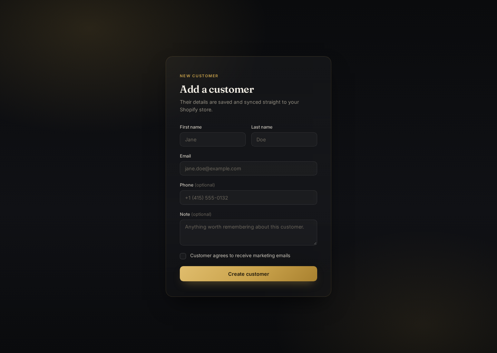
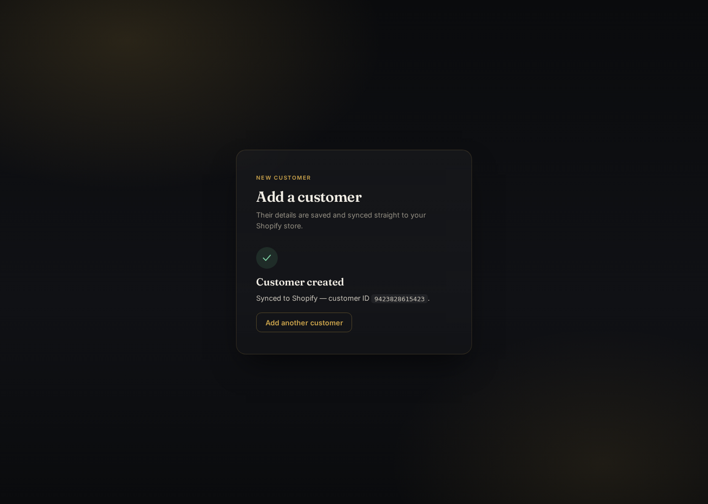

# Shopify Customer Onboarding

A production-style customer entry form: fill it in, and the customer is created both in a local system of record and in a connected Shopify store — built as a take-home style exercise, treated like real production work.




## What it does

1. A visitor fills out the customer form (name, email, phone, marketing consent, note).
2. The Angular app posts it to a .NET API.
3. The API validates the request, persists the customer in Postgres as the source of truth, then pushes it to the Shopify Admin API.
4. If Shopify is unreachable or rejects the request, the customer is still saved locally with a `Failed` sync status and a reason — nothing is silently lost, and the failure is visible in both the API response and the database.

## Stack

| Layer | Choice | Why |
|---|---|---|
| Frontend | Angular 22 (standalone components, signals, reactive forms) | Modern Angular idioms, no NgModules, zoneless-ready |
| Backend | .NET 10 / ASP.NET Core Web API | Strong typing, first-class EF Core + Postgres support |
| Database | PostgreSQL 16 | Free, robust, plays well with Docker |
| Validation | FluentValidation | Keeps validation rules declarative and testable in isolation |
| Integration | Shopify Admin REST API (`/customers.json`) via typed `HttpClient` + Polly retries | Resilient to transient network/5xx/429 failures |
| Containerization | Docker Compose (Postgres + API + Nginx-served Angular build) | One-command local spin-up, close to how it'd deploy |
| Testing | xUnit, NSubstitute, FluentAssertions (v7, MIT-licensed) | Handler and domain logic tested without hitting the network |

**No MediatR.** It moved to a commercial license for anything beyond dev/test in recent versions. Rather than ship an unlicensed dependency, the CQRS-style command pipeline (`ICommand` / `ICommandHandler` / `ISender`) is hand-rolled in about 60 lines — see [`Application/Common/Messaging`](backend/src/Application/Common/Messaging). Same ergonomics, zero licensing risk.

## Architecture

Clean Architecture with a small dose of DDD, enforced by project references (inner layers never reference outer ones):

```
Domain            <- no dependencies. Entities, value objects, repository interfaces.
  ^
Application       <- depends on Domain only. Use cases, DTOs, validation, ports (interfaces) to the outside world.
  ^
Infrastructure    <- depends on Application + Domain. EF Core, Postgres, the Shopify HTTP client.
  ^
Api               <- depends on all three. Controllers, DI composition root, middleware.
```

- **`Customer`** (`Domain/Customers/Customer.cs`) is the aggregate root. It's constructed through a `Create` factory that enforces invariants, and exposes `MarkAsSynced` / `MarkSyncFailed` instead of public setters — the sync state machine lives in the domain, not the handler.
- **Value objects** (`EmailAddress`, `PhoneNumber`, `PersonName`) validate and normalize themselves at construction, so an invalid email can't exist as a `Customer.Email` anywhere in the system.
- **`IShopifyCustomerGateway`** is defined in `Application` and implemented in `Infrastructure` — the use case depends on an abstraction, not on Shopify or `HttpClient`.
- **Repository pattern**: `ICustomerRepository` in `Domain`, `CustomerRepository` (EF Core) in `Infrastructure`.

### Request flow

```
Angular form
   -> POST /api/customers
   -> CustomersController
   -> ISender.Send(CreateCustomerCommand)
        -> FluentValidation validators run first
        -> CreateCustomerCommandHandler
             -> ICustomerRepository (duplicate-email check, persist)
             -> IShopifyCustomerGateway (push to Shopify, with retries)
             -> Customer.MarkAsSynced / MarkSyncFailed
             -> SaveChanges
   -> CreateCustomerResult -> JSON response
```

Errors are mapped centrally in `ExceptionHandlingMiddleware` to RFC 7807 `ProblemDetails` responses (`400` validation, `409` duplicate email, `500` fallback), so controllers stay thin.

## Code highlights

**Domain invariants live in the aggregate, not scattered across handlers:**

```csharp
// Domain/Customers/Customer.cs
public void MarkSyncFailed(string reason)
{
    SyncStatus = CustomerSyncStatus.Failed;
    SyncFailureReason = reason;
}
```

**A dependency-free command dispatcher** (why: see the MediatR note above) — resolves the handler and any FluentValidation validators from DI, no reflection magic beyond that:

```csharp
// Application/Common/Messaging/Sender.cs
public async Task<TResponse> Send<TResponse>(ICommand<TResponse> command, CancellationToken cancellationToken)
{
    var commandType = command.GetType();
    var validators = _serviceProvider
        .GetServices(typeof(IValidator<>).MakeGenericType(commandType))
        .Cast<IValidator>().ToList();

    if (validators.Count > 0)
    {
        var context = new ValidationContext<object>(command);
        var failures = new List<ValidationFailure>();
        foreach (var validator in validators)
            failures.AddRange((await validator.ValidateAsync(context, cancellationToken)).Errors);

        if (failures.Count > 0) throw new ValidationException(failures);
    }

    dynamic handler = _serviceProvider.GetRequiredService(
        typeof(ICommandHandler<,>).MakeGenericType(commandType, typeof(TResponse)));
    return await handler.Handle((dynamic)command, cancellationToken);
}
```

**Shopify sync failure doesn't lose the customer** — it's recorded, not thrown away:

```csharp
// Application/Customers/Commands/CreateCustomer/CreateCustomerCommandHandler.cs
var gatewayResult = await _shopifyGateway.CreateCustomerAsync(customer, cancellationToken);

if (gatewayResult.Success)
    customer.MarkAsSynced(gatewayResult.ShopifyCustomerId!);
else
    customer.MarkSyncFailed(gatewayResult.ErrorMessage ?? "Unknown Shopify error.");

await _unitOfWork.SaveChangesAsync(cancellationToken);
```

**Resilient outbound HTTP** — retries transient failures and 429s with exponential backoff via Polly:

```csharp
// Infrastructure/DependencyInjection.cs
private static IAsyncPolicy<HttpResponseMessage> GetRetryPolicy() =>
    HttpPolicyExtensions.HandleTransientHttpError()
        .OrResult(msg => (int)msg.StatusCode == 429)
        .WaitAndRetryAsync(3, attempt => TimeSpan.FromSeconds(Math.Pow(2, attempt)));
```

## Running it

### Docker (recommended)

```bash
cp .env.example .env   # fill in your Shopify store domain + Admin API token
docker compose up --build
```

- Frontend: http://localhost:4200
- API: http://localhost:5000/api (Swagger at `/swagger` in dev)
- Postgres: localhost:5432

### Locally, without Docker

```bash
# Postgres only, via Docker
docker compose up -d postgres

# API
cd backend
dotnet user-secrets set "Shopify:ShopDomain" "your-store.myshopify.com" --project src/Api
dotnet user-secrets set "Shopify:AccessToken" "shpat_..." --project src/Api
dotnet run --project src/Api

# Frontend, in another terminal
cd frontend
npm install
npm start
```

## Getting a Shopify Admin API token

1. Create a free [Shopify Partner account](https://partners.shopify.com) and a development store.
2. In the store admin: **Settings → Apps and sales channels → Develop apps** (allow custom app development if prompted).
3. **Create an app** → **Configuration** → **Admin API integration** → grant `read_customers` and `write_customers`.
4. **Install app** → **API credentials** tab → reveal the Admin API access token (`shpat_...`).

## Testing

```bash
cd backend
dotnet test
```

25 tests across `Domain.UnitTests` (value object and aggregate invariants) and `Application.UnitTests` (command handler and validator behavior, Shopify gateway mocked via NSubstitute — no network calls in the suite).

## Project structure

```
backend/
  src/
    Domain/            entities, value objects, repository interfaces — no external dependencies
    Application/        use cases (CQRS-style commands), validation, ports (interfaces)
    Infrastructure/     EF Core + Postgres, Shopify Admin API client
    Api/                controllers, middleware, composition root
  tests/
    Domain.UnitTests/
    Application.UnitTests/
frontend/
  src/app/
    core/               API service, models
    features/
      customer-form/    the form itself
docker-compose.yml
```

## Design decisions & trade-offs

- **Local persistence is the source of truth, not Shopify.** If Shopify sync fails, the customer isn't lost — it's retryable later (a background reconciliation job would be the natural next step, out of scope here).
- **Email uniqueness is enforced locally** (unique index + application-level check) rather than relying on Shopify's own duplicate check, so the conflict is caught before an unnecessary API call.
- **No auth on the API.** Out of scope for a take-home form; a real deployment would put this behind an authenticated internal tool or rate-limited public endpoint.
- **REST over GraphQL for the Shopify integration.** Shopify's REST Admin API for customer creation is simpler and stable; GraphQL would be the choice if this needed to grow into a broader Shopify integration.
